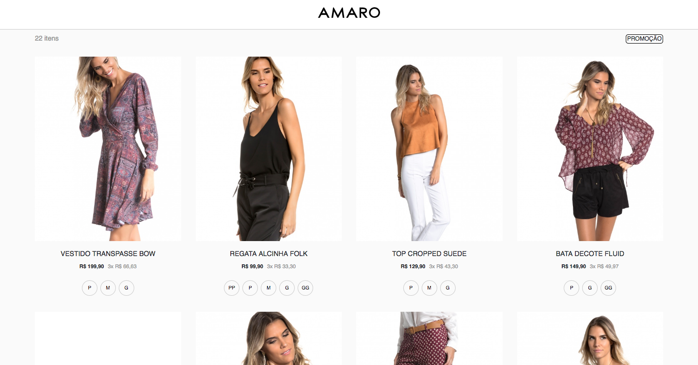
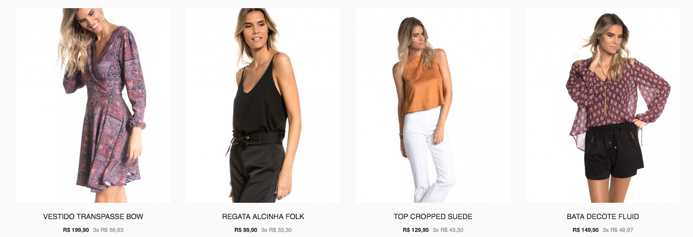
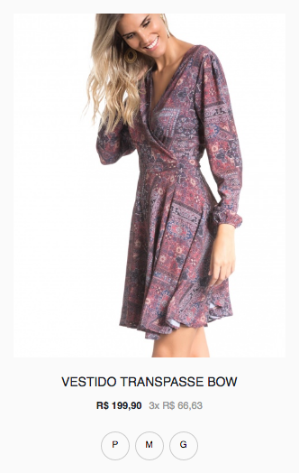
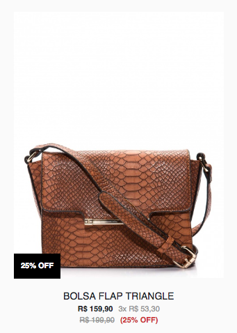
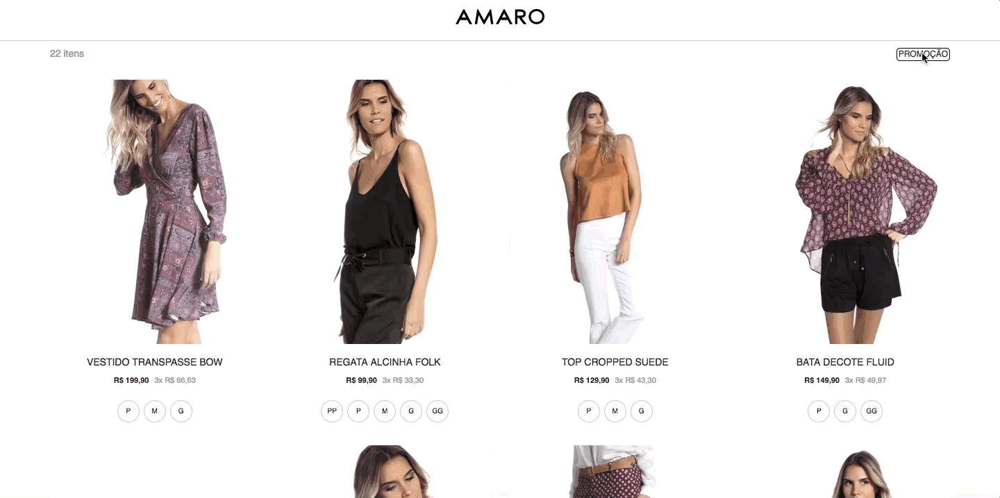

# Amaro Challenge

## Descrição
---

A empresa [Amaro](https://amaro.com) está em busca de um profissional Front-end, para isto ela criou o [AMARO front-end challenge](https://github.com/amarofashion/front-end-challenge) que pretente criar um catalogo de produtos para a loja baseado no arquivo [products.json](code/data/products.json).

Para ajudar a inicialização do desafio foi definido uma proposta de layout estático disponível no arquivo [code.zip](code.zip) e ilustrado na Figura 1.

*Figura 1 - Layout da Página*


A seguir será descrito alguns componentes para auxiliar a geração dinâmica da página usando as informações do arquivo JSON.

## Componentes
---
**COMPONENTE 1 -** No arquivo JSON existe um Array de produtos que possui várias informação como nome, preço, valor do parcelamento e URL da imagem:

```js
{
  "name": "VESTIDO TRANSPASSE BOW",
  "style": "20002605",
  "code_color": "20002605_613",
  "color_slug": "tapecaria",
  "color": "TAPEÇARIA",
  "on_sale": false,
  "regular_price": "R$ 199,90",
  "actual_price": "R$ 199,90",
  "discount_percentage": "",
  "installments": "3x R$ 66,63",
  "image": "https://d3l7rqep7l31az.cloudfront.net/images/products/20002605_615_catalog_1.jpg?1460136912",
  "sizes": [
    ...
  ]
}
```

Usando esses dados crie uma lista de produtos conforme ilustra à *Figura 2*.

*Figura 2 - Lista de produtos*<br>


Também considere que o HTML necessário para compor este grid de produtos deve ser este:

```html
<li class="product-item">
  <div class="product-box-image">
    
  </div>
  <p class="product-name">VESTIDO TRANSPASSE BOW</p>
  <div class="product-price">
    <p class="product-cost">
      <span class="actual-price">R$ 199,90</span>
      <span class="installments">3x R$ 66,63</span>
    </p>
  </div>
</li>
```

Detalhe, quando a URL da imagem vier vazia use `fallbackImage` como alternativa.

```js
const fallbackImage = 'http://dummyimage.com/470x594/fff/000?text=imagem+indisponível'
```

**COMPONENTE 2 -** No Array de produto também existem detalhes sobre os seus tamanhos, por exemplo, no primeiro produto, o *VESTIDO TRANSPASSE BOW*, o JSON descreve:

```js
{
  "name": "VESTIDO TRANSPASSE BOW",
  ...
  "sizes": [
    {
      "available": false,
      "size": "PP",
      "sku": "5807_343_0_PP"
    },
    {
      "available": true,
      "size": "P",
      "sku": "5807_343_0_P"
    },
    {
      "available": true,
      "size": "M",
      "sku": "5807_343_0_M"
    },
    {
      "available": true,
      "size": "G",
      "sku": "5807_343_0_G"
    },
    {
      "available": false,
      "size": "GG",
      "sku": "5807_343_0_GG"
    }
  ]
}
```

Usando esses dados crie cada produto com os seus tamanhos disponíveis, conforme ilustra à *Figura 3*, ou seja, do total de 5 tamanhos existentes apenas 3 estão disponíveis.

*Figura 3 - Tamanho disponível dos produto*<br>


Também considere que o HTML necessário para compor cada produto deve conter a lista `.product-sizes`:

```html
<li class="product-item">
  <div class="product-box-image">
    
  </div>
  <p class="product-name">VESTIDO TRANSPASSE BOW</p>
  <div class="product-price">
    <p class="product-cost">
      <span class="actual-price">R$ 199,90</span>
      <span class="installments">3x R$ 66,63</span>
    </p>
  </div>
  <ul class="product-sizes">
    <li>
      <a href="#" class="size available">P</a>
    </li>
    <li>
      <a href="#" class="size available">M</a>
    </li>
    <li>
      <a href="#" class="size available">G</a>
    </li>
  </ul>
</li>
```

**COMPONENTE 3 -** No JSON cada produto possui o campo `on_sale` que determina se o produto está em promoção ou não. 

Quando o produto não está em promoção o valor total do desconto fica em branco, e o valor original possui o mesmo do final, como é possível ver no produto *VESTIDO TRANSPASSE BOW*:

```js
{
  "name": "VESTIDO TRANSPASSE BOW",
  "style": "20002605",
  "code_color": "20002605_613",
  "color_slug": "tapecaria",
  "color": "TAPEÇARIA",
  "on_sale": false,
  "regular_price": "R$ 199,90",
  "actual_price": "R$ 199,90",
  "discount_percentage": "",
  "installments": "3x R$ 66,63",
  ...
}
```

Contudo, quando o produto está na promoção os dados são preenchido conforme o desconto, por exemplo, veja o produto *BOLSA FLAP TRIANGLE*:

```js
{
  "name": "BOLSA FLAP TRIANGLE",
  "style": "20002945",
  "code_color": "20002945_027",
  "color_slug": "caramelo",
  "color": "CARAMELO",
  "on_sale": true,
  "regular_price": "R$ 199,90",
  "actual_price": "R$ 159,90",
  "discount_percentage": "25%",
  "installments": "3x R$ 53,30",
  ...
}
```

Então, usando esses dados adapte cada produto que esteja em promoção para que seja exibido conforme à *Figura 4*.

*Figura 4 - Produto na promoção*<br>


Considere que o HTML necessário para compor cada produto em promoção deve conter a seguinte estrutura:

```html
<li class="product-item">
  <div class="product-box-image">
    <span class="stamp">25% OFF</span>
    
  </div>
  <p class="product-name">BOLSA FLAP TRIANGLE</p>
  <div class="product-price">
    <p class="product-cost">
      <span class="actual-price">R$ 159,90</span>
      <span class="installments">3x R$ 53,30</span>
    </p>
    <p class="product-sale">
      <del class="regular-price">R$ 199,90</del>
      <span class="stamp">(25% OFF)</span>
    </p>
  </div>
  <ul class="product-sizes">
    <li>
      <a href="#" class="size available">U</a>
    </li>
  </ul>
</li>
```

**COMPONENTE 4 -** Pensando em facilitar apenas a listagem dos produtos em promoção o layout propõe a criação de um botão `PROMOÇÃO` no topo da página, ao ativá-lo a ação do catálogo deve ser filtrar os produtos conforme ilusta a *Figura 5*. Perceba que na parte superior também existe uma indição do total de itens listados.

*Figura 5 - Filtro de produtos*<br>
