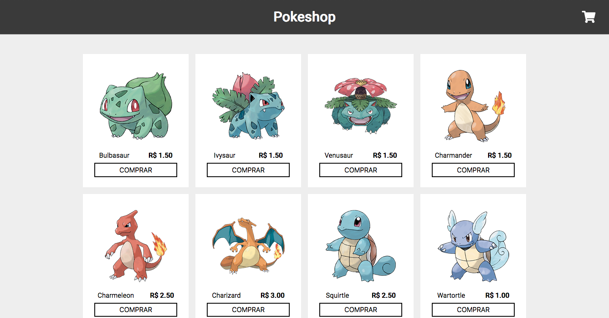
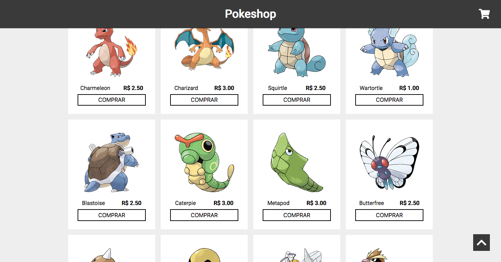

# Pokeshop Challenge

## Descrição
---

Uma empresa de artigos Nerd está em busca de profissionais para criar um e-commerce de Action Figures de Pokemons.

A princípio a empresa disponibilizou os dados dos Pokemons no arquivo [pokeshop.json](code/data/pokeshop.json) e pretende criar uma tela semelhante ao da Figura 1.

*Figura 1 - Layout da Página*


Detalhe, a empresa já disponibilizou uma estrutura inicial no arquivo [code.zip](code.zip), e a seguir será descrito alguns componentes para auxiliar a geração dinâmica da página usando as informações do arquivo JSON.

## Componentes
---
**COMPONENTE 1 -** No arquivo JSON existe um Array de Pokemons que possui várias informação como nome, preço e URL da imagem:

```js
[
  {
    "img": "img/001.png",
    "name": "Bulbasaur",
    "price": 1.50
  },
  ...
]
```

Usando esses dados crie uma lista de Pokemons conforme ilustra a *Figura 2*.

*Figura 2 - Lista de Pokemons*<br>


Também considere que o HTML necessário para compor este grid de Pokemons deve possuir uma estrutura, como esta para o Pokemon Bulbasaur:

```html
<div class="pokemon-view">
  
  <span class="pokemon-view-name">Bulbasaur</span>
  <span class="pokemon-view-price">R$ 1.50</span>
  <button class="pokemon-view-shop">COMPRAR</button>
</div>
```

**COMPONENTE 2 -** Uma das exigências para o grid de Pokemons é que houvesse um botão para navegar ao topo da página, pois o grid possui muitos itens. Pensando nisso, foi solicitado que ele fosse oculto a princípio, mas quando o scroll vertical (`window.scrollY`) for maior que 1/3 da altura do viewport (`window.innerHeight`) o botão deve ser exibido conforme a *Figura 3*.

*Figura 3 - Botão de Navegação*<br>


Além disso, quando o botão for clicado a página deve ser navegado ao top usando o código a seguir: 

```js
window.scrollTo({
  behavior: 'smooth',
  top: 0,
  left: 0
})
```

**COMPONENTE 3 -** Para indicar que a compra está sendo acionado pelo clique do botão `COMPRAR` é exigido que o ícone de carrinho de compra, localizado na parte superior direita, indique quantos Pokemons foram comprados conforme ilustra a *Figura 4*.

*Figura 4 - Adicionando ao carrinho*<br>

